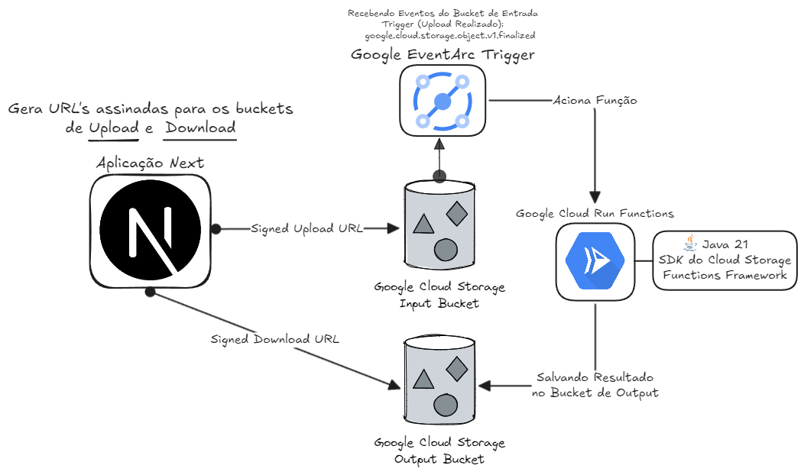
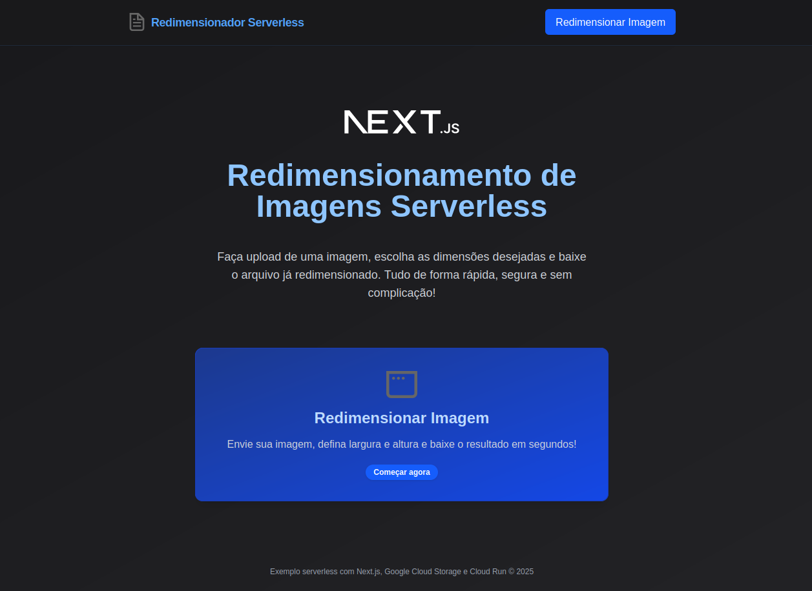
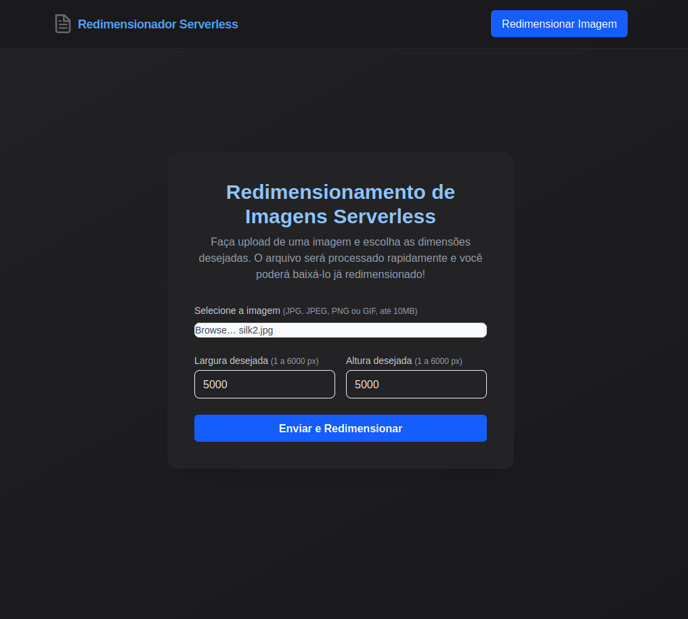
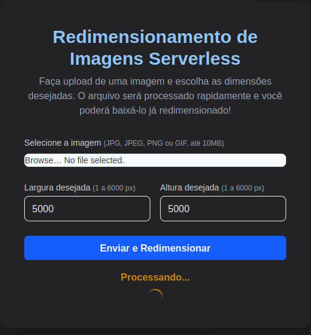
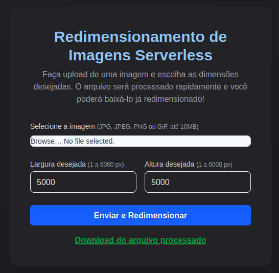

# Upload e Redimensionamento de Imagens com Cloud Functions, Google Cloud Storage e Next.js

Este projeto é uma demonstração de um sistema serverless para **upload, redimensionamento e distribuição de imagens**, utilizando:

- **Google Cloud Functions (Java)** para o redimensionamento
- **Google Cloud Storage (GCS)** como repositório central
- **Next.js** com geração de links assinados para o frontend

Desenvolvi este projeto como uma forma de praticar meus conhecimentos na **Google Cloud Platform**. Durante o processo, aprofundei meu entendimento sobre a SDK do **Cloud Storage** e explorei melhor o funcionamento do Cloud Run.

Projeto desenvolvido por:

- [github.com/tuliobaruk](https://github.com/tuliobaruk)

---

## Tecnologias Utilizadas

[](#)
[](#)
[](#)
[](#)

---

## Arquitetura

[](./docs/diagrama.png)

1. O usuário faz **upload via frontend usando URLs assinadas**
2. O arquivo é salvo diretamente no bucket de input no **GCS**
3. Um evento `google.storage.object.finalize` aciona a **Cloud Function em Java**
4. A função redimensiona a imagem e salva o resultado no **bucket de destino**
5. O frontend gera um **URL assinado** para exibição ou download da imagem resultante

---

## Pré-requisitos

- Conta no **Google Cloud Platform**
- Buckets de origem e destino no **Cloud Storage**
- Service Account com permissão de **Storage Admin** (`roles/storage.admin`)
- Arquivo `.env` corretamente configurado, e chave gerada da service account necessária gerada (Explicado abaixo)
- Gcloud CLI caso queira fazer o deploy sem utilizar a interface gráfica do Google Cloud

---

## Estrutura do Projeto

```
SRV-less/
├── FrontEnd/
│   ├── src/
│   │   ├── app/
│   │   └── lib/
│   └── .env.EXAMPLE
├── functions/
│   └── image_resizer/
│       └── src/
├── docs/
└── README.md
```

---

## Como Funciona

1. O frontend gera uma **URL assinada** com permissão de upload no GCS
2. O usuário faz upload diretamente para o bucket
3. O evento `google.storage.object.finalize` aciona a função Java automaticamente
4. A função redimensiona a imagem
5. A versão redimensionada é salva no bucket de destino
6. O frontend gera uma **URL assinada** para download e disponibiliza o resultado para o usuário
---

## Variáveis de Ambiente

### Frontend (`FrontEnd/.env`)

```env
# Nome do bucket de entrada
GCS_BUCKET_NAME=nome-do-bucket-de-entrada

# Nome do bucket de saída
GCS_OUTPUT_BUCKET_NAME=nome-do-bucket-saida

# Caminho do arquivo de chave JSON da service account
GCS_KEY_FILENAME=nome-do-arquivo.json

# Limite máximo para o redimensionamento (em pixels)
NEXT_PUBLIC_MAX_IMAGE_DIMENSION=4000
MAX_IMAGE_DIMENSION=4000
```

### Função (`functions/image_resizer`)

```env
# Bucket de destino onde a imagem redimensionada será salva
DESTINATION_BUCKET=destination-bucket

# (Opcional) Tamanho máximo permitido para redimensionamento
MAX_SIZE=4000
```

---

## Criando Recursos no GCP (Utilizando a CLI)
Caso ainda não possua a CLI da google cloud:
https://cloud.google.com/sdk/docs/install

Antes de fazer o deploy, defina variáveis de ambiente no terminal para facilitar os comandos:

```bash
# Substitua pelos valores reais do seu projeto
export PROJECT_ID=seu-projeto-id
export REGION=us-central1
export ENTRY_BUCKET=nome-do-bucket-de-entrada
export OUTPUT_BUCKET=nome-do-bucket-saida
export SERVICE_ACCOUNT=image-uploader
```

### 1. Criar Buckets

```bash
gsutil mb -p $PROJECT_ID -l $REGION gs://$ENTRY_BUCKET/
gsutil mb -p $PROJECT_ID -l $REGION gs://$OUTPUT_BUCKET/
```

### 2. Criar Service Account e Conceder Permissões

```bash
# Cria a service account
gcloud iam service-accounts create $SERVICE_ACCOUNT   --description="Permissões para acessar e gerenciar imagens no Cloud Storage"   --display-name="Image Uploader"

# Concede permissão de ADMIN no Cloud Storage
gcloud projects add-iam-policy-binding $PROJECT_ID   --member="serviceAccount:$SERVICE_ACCOUNT@$PROJECT_ID.iam.gserviceaccount.com"   --role="roles/storage.admin"
```

### 3. Gerar Arquivo de Chave (para o Frontend)

```bash
# Gera a chave no formato JSON, que será usada pelo Next.js para assinar URLs
gcloud iam service-accounts keys create ./FrontEnd/$SERVICE_ACCOUNT-key.json   --iam-account=$SERVICE_ACCOUNT@$PROJECT_ID.iam.gserviceaccount.com
```

> A esta service account **é obrigatória** para permitir que o Front **(Guarde com Cuidado)**:
> - Criação de URL's assinadas para download e upload
> - Escrita dos arquivos no bucket de entrada
> - Leitura no bucket de saída

---

## Deploy da Função Java no GCP

```bash
export FUNCTION_NAME=image-resizer

gcloud functions deploy $FUNCTION_NAME   --runtime java21   --entry-point gcfv2.MyCloudEventFunction   --trigger-event google.storage.object.finalize   --trigger-resource $ENTRY_BUCKET   --set-env-vars DESTINATION_BUCKET=$OUTPUT_BUCKET   --gen2   --region $REGION
```

---

## Rodando Localmente (Frontend)

```bash
cd FrontEnd
npm install
npm run dev
```

Acesse: [http://localhost:3000](http://localhost:3000)

---

## Upload via Interface Web

Homepage da aplicação:
[](./docs/frontEnd1.png)

Formulário para o envio da imagem:
[](./docs/frontEnd2.png)

Redimensionamento sendo processado:
[](./docs/frontEnd3.png)

Resultado do redimensionamento (1/2):
[](./docs/frontEnd4.png)

Resultado do redimensionamento (2/2):
[](./docs/frontEnd5.png)

